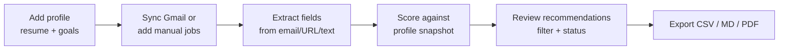

# Personal Job Opportunity Scanner

A **local-first** Python application that collects job leads from your inbox and manual inputs, extracts structured posting details, and scores each opportunity against your resume and career goals using a **transparent, weighted rubric**. Built as a personal productivity tool — not a job board, not an auto-applier, and not a LinkedIn scraper.

> **Status:** Personal project for organizing internship and entry-level job search workflows. Runs entirely on your machine; no hosted backend or multi-user deployment.

---

## Overview

Job alerts pile up quickly. This scanner helps you:

1. **Ingest** postings from Gmail (OAuth, read-only), pasted descriptions, or URLs you submit.
2. **Build a profile snapshot** from your resume, LinkedIn export, and stated career goals.
3. **Score and rank** opportunities with explainable breakdowns (skills, industry fit, experience level, location, and more).
4. **Track status** (saved, applied, rejected, etc.) and **export** filtered lists to Markdown, CSV, or PDF.

Scoring is rule-based and configurable via YAML. Optional OpenAI/Anthropic enrichment exists but is **disabled by default**.

---

## Key features

| Area | What it does |
|------|----------------|
| **Gmail sync** | Read-only OAuth; configurable search query, scan window, and role focus (internships, entry-level, any). |
| **Manual intake** | Paste job text or submit a public URL (optional HTTP fetch of page content). |
| **Profile management** | Upload or paste resume (PDF/DOCX/TXT), LinkedIn export, and career goals; merged into a snapshot for scoring. |
| **Weighted scoring** | Seven components (technical match, industry interest, experience fit, role focus, location/remote, company relevance, application ease) with tier labels: Strong Apply, Apply, Maybe, Skip. |
| **Actionable output** | Missing qualifications, suggested resume keywords, and cover-letter bullet starters per job. |
| **Recommendations UI** | Filter by score, company, industry, location, status, and date; inspect score explanations and source email metadata. |
| **Export** | Download filtered job lists as Markdown, CSV, or PDF. |
| **Debug tab** | Inspect extraction JSON, scoring context, and raw description text for troubleshooting. |
| **Optional LLM** | Structured field enrichment via OpenAI or Anthropic when explicitly enabled in `.env`. |

**Explicitly not included:** LinkedIn scraping, automated applications, background schedulers, or cloud hosting.

---

## Tech stack

| Layer | Technologies |
|-------|----------------|
| **UI** | [Streamlit](https://streamlit.io/) |
| **Data** | SQLite via [SQLAlchemy](https://www.sqlalchemy.org/) 2.x |
| **Config** | `pydantic-settings`, `.env`, YAML (`config/`) |
| **Email** | Gmail API (`google-api-python-client`, OAuth 2.0) |
| **Document parsing** | `pypdf`, `python-docx` |
| **HTTP / HTML** | `httpx`, `beautifulsoup4`, `lxml` |
| **Export** | `pandas`, `fpdf2` |
| **Optional AI** | `openai`, `anthropic` (off by default) |
| **Tests** | `pytest` |

---

## Demo workflow

Typical end-to-end flow after setup:



1. **Profile** — Upload or paste your resume and career goals; confirm the profile snapshot shows inferred skills.
2. **Gmail** — Run one-time OAuth setup, then use **Sync Gmail now** in the sidebar (adjust role focus and scan window as needed).
3. **Recommendations** — Review scored jobs (default minimum score: 70), read “Why this score” and missing qualifications.
4. **Manual jobs** — Add postings you find outside email (paste text or URL).
5. **Export** — Download a filtered report for offline review or sharing (redact sensitive content yourself).

### Screenshots

Add your own screenshots after running the app locally. Suggested filenames under `docs/screenshots/`:

| Placeholder | Suggested capture |
|-------------|-------------------|
| `docs/screenshots/recommendations.png` | Recommendations tab with scored jobs and filters |
| `docs/screenshots/profile.png` | Profile tab showing snapshot and document upload |
| `docs/screenshots/gmail-sync.png` | Sidebar Gmail sync controls and active query |
| `docs/screenshots/job-detail.png` | Job detail panel with score breakdown and status |

```markdown
<!-- Replace paths below once you add real screenshots -->

*Placeholder — capture the Recommendations tab after syncing jobs.*


*Placeholder — capture the Profile tab with a resume loaded.*
```

> Do not commit real inbox content, employer names you are not comfortable sharing, or any credentials in screenshot files.

---

## Architecture

```
┌─────────────────────────────────────────────────────────────┐
│                  Streamlit UI (streamlit_app.py)            │
│  Recommendations │ Profile │ Manual jobs │ Export │ Debug   │
└────────────────────────────┬────────────────────────────────┘
                             │
        ┌────────────────────┼────────────────────┐
        ▼                    ▼                    ▼
  email_sync.py        profile_parser.py     job_extract.py
  gmail_client.py      scoring.py            email_job_extract.py
        │                    │                    │
        └────────────────────┼────────────────────┘
                             ▼
                    SQLite (data/app.db)
                    models: Job, ProfileSnapshot,
                    ProfileDocument, EmailMessage, …
```

**Data flow**

- **Ingest:** Gmail messages or manual input → field extraction (regex/heuristics; optional LLM) → `Job` rows with deduplication.
- **Profile:** Documents merged → `ProfileSnapshot` with inferred skills and experience band.
- **Score:** `scoring.py` loads weights from `config/scoring_weights.yaml` and interest keywords from `config/interest_keywords.yaml`, then writes scores and JSON breakdowns back to each job.
- **Present:** Streamlit reads the database; export services format the same filtered query results.

---

## Project structure

```
.
├── app/
│   ├── config.py              # Environment settings (Pydantic)
│   ├── main.py                # Entry pointer → Streamlit
│   ├── db/
│   │   ├── models.py          # SQLAlchemy ORM models
│   │   └── session.py         # Engine and session helpers
│   ├── services/
│   │   ├── gmail_client.py    # Gmail API client + OAuth
│   │   ├── email_sync.py      # Sync messages, build queries
│   │   ├── email_job_extract.py
│   │   ├── job_extract.py     # Manual URL/text ingestion
│   │   ├── job_text_utils.py
│   │   ├── profile_parser.py  # Resume/LinkedIn parsing
│   │   ├── scoring.py         # Weighted rubric + tiers
│   │   ├── llm_enrichment.py  # Optional LLM (disabled default)
│   │   └── export.py          # Markdown, CSV, PDF export
│   └── ui/
│       └── streamlit_app.py   # Dashboard
├── config/
│   ├── scoring_weights.yaml   # Component weights and tier cutoffs
│   └── interest_keywords.yaml # Industry/skill interest keywords
├── data/                      # Local DB, OAuth files (gitignored)
├── docs/
│   ├── privacy.md             # Data handling details
│   └── screenshots/           # Add your UI screenshots here
├── scripts/
│   └── gmail_oauth_setup.py   # One-time Gmail consent helper
├── tests/
│   ├── test_scoring.py
│   └── test_email_extraction.py
├── .env.example
├── requirements.txt
└── README.md
```

---

## Privacy and security

This app is designed for **personal, local use** on your machine.

| Topic | Practice |
|-------|----------|
| **Secrets** | `.env`, `data/credentials.json`, and `data/tokens/` are gitignored. Never commit API keys or OAuth tokens. |
| **Gmail** | Read-only scope (`gmail.readonly`). You authorize via OAuth; narrow `GMAIL_QUERY` to limit fetched messages. |
| **Database** | `data/app.db` stores profile text, job records, and synced email metadata locally. |
| **Third-party URLs** | Manual URL fetch only runs when **you** submit a link. Respect site terms and robots rules. |
| **LLM** | Disabled by default. Enabling sends job text excerpts to the provider you configure. |
| **No auto-apply** | The tool does not submit applications or interact with employer portals on your behalf. |

See [`docs/privacy.md`](docs/privacy.md) for a fuller breakdown of what is stored locally.

---

## Setup

### Prerequisites

- Python 3.11+ recommended
- A Google Cloud project with **Gmail API** enabled (for inbox sync)
- (Optional) OpenAI or Anthropic API key — only if you set `ENABLE_LLM=true`

### 1. Clone and install

```powershell
git clone <your-repo-url>
cd job-opportunity-scanner   # or your clone directory
python -m venv .venv
.\.venv\Scripts\activate     # macOS/Linux: source .venv/bin/activate
pip install -r requirements.txt
copy .env.example .env       # macOS/Linux: cp .env.example .env
```

Run Streamlit from the **project root** so imports like `app.config` resolve:

```powershell
streamlit run app/ui/streamlit_app.py
```

### 2. Gmail OAuth (optional but recommended)

1. In [Google Cloud Console](https://console.cloud.google.com/), create a project and enable the **Gmail API**.
2. Configure the **OAuth consent screen** (for personal testing, add your Google account as a test user).
3. Create **OAuth client ID** credentials of type **Desktop app**.
4. Download the JSON and save as `data/credentials.json` (or set `GMAIL_CREDENTIALS_PATH` in `.env`).
5. Run the one-time consent helper:

```powershell
python scripts/gmail_oauth_setup.py
```

This stores a refresh token at `data/tokens/gmail_token.json`. Scope used: `https://www.googleapis.com/auth/gmail.readonly`.

Edit `GMAIL_QUERY` in `.env` to match senders and subjects in your inbox. The UI can also build queries from role focus and scan-window controls.

### 3. Configuration reference

| Variable | Purpose |
|----------|---------|
| `DATABASE_URL` | SQLite URL (default: `data/app.db`) |
| `GMAIL_CREDENTIALS_PATH` | OAuth client JSON path |
| `GMAIL_TOKEN_PATH` | Saved token path |
| `GMAIL_QUERY` | Default Gmail search query for sync |
| `GMAIL_SYNC_MAX_RESULTS` | Max messages per sync |
| `ENABLE_LLM` | `false` by default |
| `OPENAI_API_KEY` / `ANTHROPIC_API_KEY` | Only if LLM is enabled |
| `LLM_PROVIDER` | `openai` or `anthropic` |

YAML configuration:

- [`config/scoring_weights.yaml`](config/scoring_weights.yaml) — component weights, tier cutoffs, application-difficulty hints.
- [`config/interest_keywords.yaml`](config/interest_keywords.yaml) — industry and skill interest keywords, synonyms.

---

## Testing

From the project root with the virtual environment activated:

```powershell
pytest
```

Tests cover scoring logic, Gmail query construction, profile parsing behavior, and email extraction helpers. They run against in-memory or fixture data — no live Gmail or paid API calls required.

```powershell
# Run a single file
pytest tests/test_scoring.py -v

# Run a single test
pytest tests/test_scoring.py::test_score_job_row_without_profile -v
```

---

## Limitations (honest scope)

- Scoring is heuristic and YAML-tuned, not a trained ML ranker.
- Email alert bodies are often sparse; extraction quality varies by sender format.
- RSS ingestion is modeled in the schema but not exposed in the current UI.
- No mobile app, team collaboration, or hosted deployment — single-user, local SQLite only.

---

## License

Add a license file if you plan to open-source this repository publicly. Until then, treat it as a personal portfolio project.
